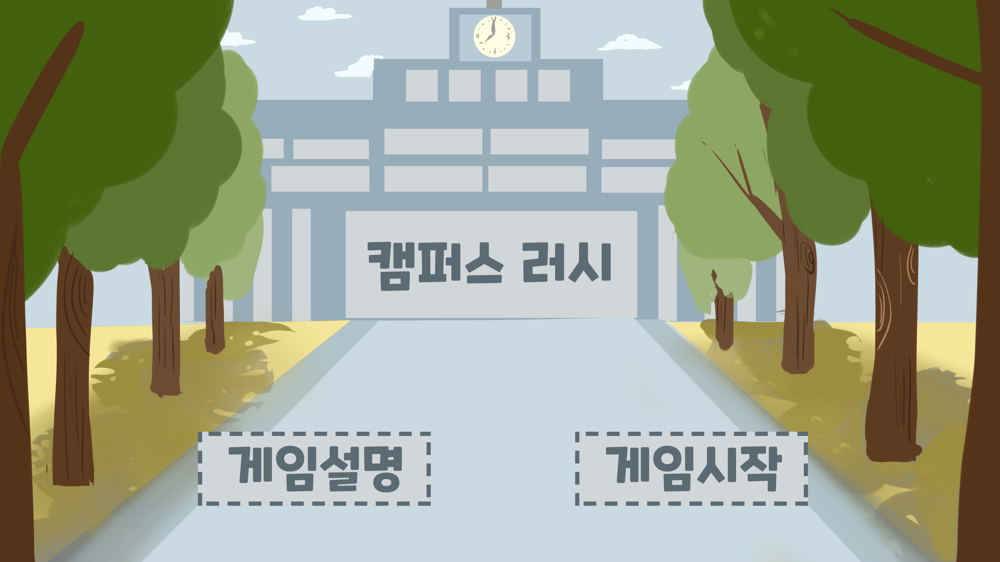

# 대학생 러닝 게임



> Ursina 엔진을 사용하여 만든 2D 러닝 게임입니다. 장애물을 피하고 아이템을 활용해 점수를 올리는 게임입니다.

---

## 🎮 게임 설명

- **목표**: 점수를 높이며 끝까지 살아남기!
- **조작**:
  - `← / →` 또는 `A / D`: 좌우 이동
  - `Space`: 점프
- **게임 요소**:
  - 장애물: 과제, 노트북, 팀플 팀원 등
  - 아이템:
    - ❤️ 체력 회복
    - 📄 휴학 신청서 (무적 상태)

---

## 실행 방법

1. **필수 환경 설치**:
   ```bash
   pip install ursina


---

| 점수 구간      | 등급 | 엔딩 음악    |
| ---------- | -- | -------- |
| ≤ 100      | F  | f.mp3    |
| 101\~250   | D  | 엔딩.mp3   |
| 251\~450   | C+ | 엔딩.mp3   |
| 451\~700   | B+ | 엔딩.mp3   |
| 701\~999   | A  | 엔딩.mp3   |
| 1000\~1999 | A+ | 엔딩.mp3   |
| ≥ 2000     | S  | 히든엔딩.mp3 |


